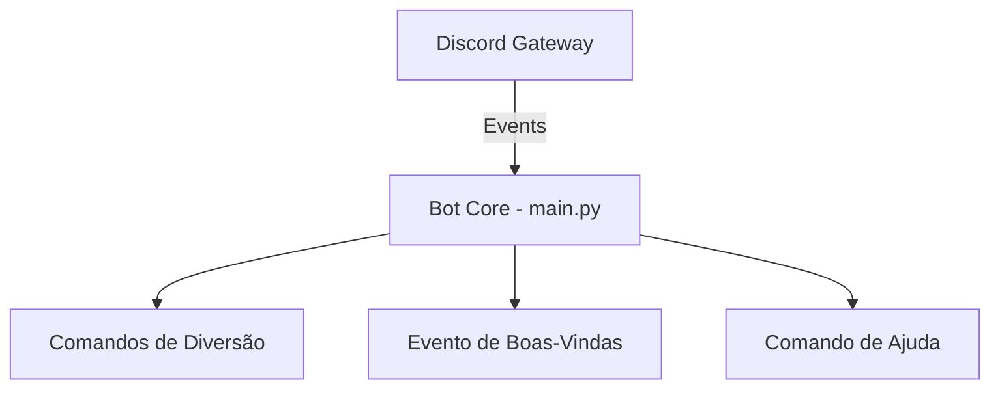
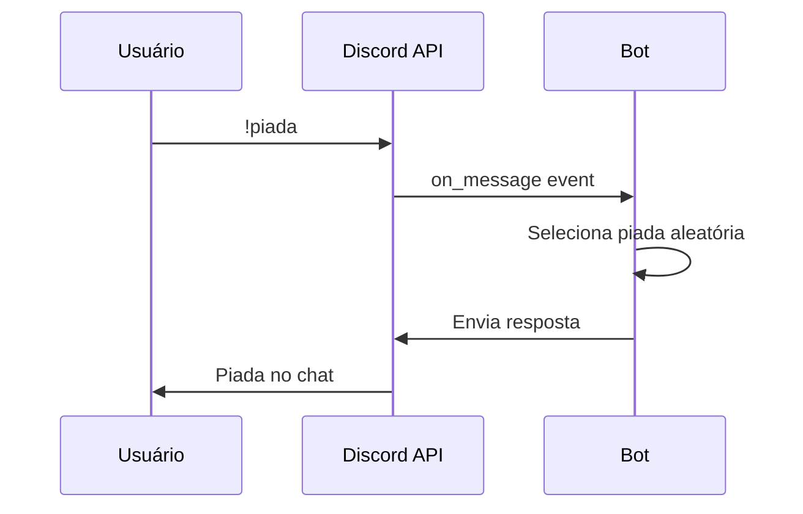
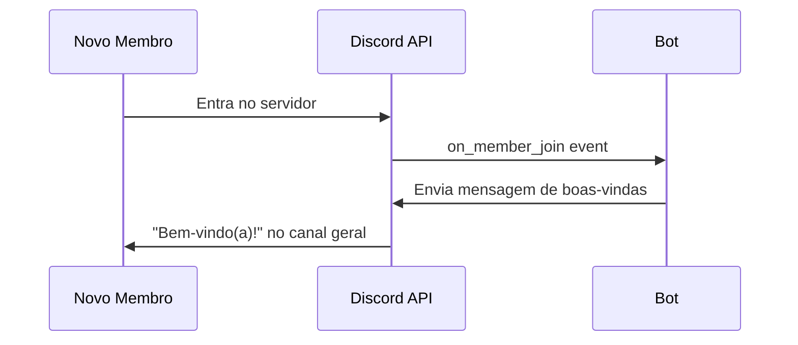

# Design Document: Discord Friends Bot

## Overview

Bot Discord simples para um servidor de amigos, feito para ser divertido e fácil de usar. O bot oferece comandos básicos de diversão como piadas, bola 8 mágica, sorteio e dados — perfeito para um grupo de amigos se divertir.

A arquitetura é minimalista: um bot único usando discord.py com comandos organizados em um único módulo. Sem banco de dados, sem complexidade desnecessária — apenas diversão instantânea.

O design prioriza simplicidade acima de tudo: poucos arquivos, fácil de rodar, fácil de entender e modificar.

## Architecture



## Sequence Diagrams

### Fluxo Principal: Execução de Comando



### Fluxo de Boas-Vindas



## Components and Interfaces

### Component 1: Bot Core (main.py)

**Purpose**: Arquivo principal que inicializa o bot, registra comandos e gerencia eventos.

```python
import discord
from discord.ext import commands

class FriendsBot(commands.Bot):
    """Bot simples para servidor de amigos."""
    
    def __init__(self) -> None: ...
    async def on_ready(self) -> None: ...
    async def on_member_join(self, member: discord.Member) -> None: ...
```

**Responsibilities**:
- Conectar ao Discord
- Responder a comandos com prefixo `!`
- Dar boas-vindas a novos membros

### Component 2: Comandos de Diversão

**Purpose**: Conjunto de comandos simples para entretenimento.

```python
@bot.command(name="piada")
async def piada(ctx: commands.Context) -> None:
    """Conta uma piada aleatória."""
    ...

@bot.command(name="8ball")
async def bola8(ctx: commands.Context, *, pergunta: str) -> None:
    """Bola 8 mágica responde sua pergunta."""
    ...

@bot.command(name="dado")
async def dado(ctx: commands.Context, lados: int = 6) -> None:
    """Rola um dado com N lados."""
    ...

@bot.command(name="sorteio")
async def sorteio(ctx: commands.Context, *opcoes: str) -> None:
    """Escolhe aleatoriamente entre as opções dadas."""
    ...

@bot.command(name="moeda")
async def moeda(ctx: commands.Context) -> None:
    """Joga cara ou coroa."""
    ...
```

## Data Models

### Model 1: Configuração do Bot (via .env)

```python
# Variáveis de ambiente (.env)
DISCORD_TOKEN: str  # Token do bot do Discord Developer Portal
PREFIX: str = "!"   # Prefixo dos comandos (padrão: !)
```

**Validation Rules**:
- `DISCORD_TOKEN` é obrigatório e deve ser um token válido do Discord
- `PREFIX` deve ter entre 1 e 3 caracteres

### Model 2: Listas de Conteúdo (constantes no código)

```python
PIADAS: list[str] = [
    "Por que o programador usa óculos? Porque não consegue C#!",
    "O que o zero disse para o oito? Bonito cinto!",
    # ...mais piadas
]

RESPOSTAS_8BALL: list[str] = [
    "Com certeza! ✅",
    "Sem dúvida! 🎯",
    "Talvez... 🤔",
    "Não conte com isso ❌",
    # ...mais respostas
]
```

**Validation Rules**:
- Cada lista deve ter pelo menos 5 itens para variedade
- Strings não devem exceder 200 caracteres (limite visual do Discord)

## Key Functions with Formal Specifications

### Function 1: piada()

```python
@bot.command(name="piada")
async def piada(ctx: commands.Context) -> None:
    """Envia uma piada aleatória no canal."""
```

**Preconditions:**
- `ctx` é um contexto válido de comando do Discord
- `PIADAS` contém pelo menos 1 item

**Postconditions:**
- Uma mensagem é enviada no canal de onde o comando veio
- A mensagem contém exatamente um item de `PIADAS`

**Loop Invariants:** N/A

### Function 2: bola8()

```python
@bot.command(name="8ball")
async def bola8(ctx: commands.Context, *, pergunta: str) -> None:
    """Responde uma pergunta com a bola 8 mágica."""
```

**Preconditions:**
- `ctx` é um contexto válido
- `pergunta` é uma string não-vazia
- `RESPOSTAS_8BALL` contém pelo menos 1 item

**Postconditions:**
- Uma mensagem é enviada contendo a pergunta e uma resposta aleatória
- A resposta vem da lista `RESPOSTAS_8BALL`

**Loop Invariants:** N/A

### Function 3: dado()

```python
@bot.command(name="dado")
async def dado(ctx: commands.Context, lados: int = 6) -> None:
    """Rola um dado com o número de lados especificado."""
```

**Preconditions:**
- `lados` é um inteiro positivo (lados >= 2)

**Postconditions:**
- Envia mensagem com resultado entre 1 e `lados` (inclusivo)
- Se `lados` < 2, envia mensagem de erro amigável

**Loop Invariants:** N/A

### Function 4: sorteio()

```python
@bot.command(name="sorteio")
async def sorteio(ctx: commands.Context, *opcoes: str) -> None:
    """Escolhe aleatoriamente entre as opções fornecidas."""
```

**Preconditions:**
- `opcoes` contém pelo menos 2 itens

**Postconditions:**
- Envia mensagem com exatamente 1 item escolhido de `opcoes`
- Se menos de 2 opções, envia mensagem de erro amigável

**Loop Invariants:** N/A

## Algorithmic Pseudocode

### Algoritmo Principal: Inicialização do Bot

```python
def main() -> None:
    """
    Preconditions:
        - Arquivo .env existe com DISCORD_TOKEN válido
        - Pacote discord.py está instalado
    
    Postconditions:
        - Bot está conectado e respondendo comandos
    """
    # 1. Carregar variáveis de ambiente
    load_dotenv()
    token = os.getenv("DISCORD_TOKEN")
    
    # 2. Validar token
    if not token:
        raise ValueError("DISCORD_TOKEN não encontrado no .env")
    
    # 3. Configurar intents
    intents = discord.Intents.default()
    intents.message_content = True
    intents.members = True
    
    # 4. Criar e iniciar bot
    bot = commands.Bot(command_prefix="!", intents=intents)
    
    # 5. Registrar comandos e eventos
    register_commands(bot)
    register_events(bot)
    
    # 6. Conectar
    bot.run(token)
```

### Algoritmo: Seleção Aleatória Segura

```python
import random

def escolher_aleatorio(lista: list[str]) -> str:
    """
    Escolhe um item aleatório de uma lista.
    
    Preconditions:
        - lista não é vazia (len(lista) >= 1)
    
    Postconditions:
        - Retorna exatamente um item que pertence à lista original
        - Distribuição uniforme entre os itens
    
    Loop Invariants: N/A
    """
    return random.choice(lista)
```

### Algoritmo: Validação de Dado

```python
def validar_dado(lados: int) -> tuple[bool, str]:
    """
    Valida o número de lados para o comando dado.
    
    Preconditions:
        - lados é um inteiro
    
    Postconditions:
        - Se válido: retorna (True, "")
        - Se inválido: retorna (False, mensagem_erro)
        - Válido significa: 2 <= lados <= 1000
    
    Loop Invariants: N/A
    """
    if lados < 2:
        return (False, "Um dado precisa ter pelo menos 2 lados! 🎲")
    if lados > 1000:
        return (False, "Calma, esse dado é grande demais! Máximo: 1000 🎲")
    return (True, "")
```

## Example Usage

```python
# Exemplo 1: Uso básico dos comandos no Discord
# Usuário digita: !piada
# Bot responde: "Por que o programador usa óculos? Porque não consegue C#!"

# Exemplo 2: Bola 8 mágica
# Usuário digita: !8ball Vou passar na prova?
# Bot responde: "🎱 Pergunta: Vou passar na prova?\n Resposta: Com certeza! ✅"

# Exemplo 3: Rolar dado
# Usuário digita: !dado 20
# Bot responde: "🎲 Você rolou um d20 e tirou: 17!"

# Exemplo 4: Sorteio
# Usuário digita: !sorteio pizza hamburguer sushi
# Bot responde: "🎯 E o sorteado é... **sushi**!"

# Exemplo 5: Cara ou coroa
# Usuário digita: !moeda
# Bot responde: "🪙 Cara!" ou "🪙 Coroa!"
```

## Correctness Properties

*Uma propriedade é uma característica ou comportamento que deve ser verdadeiro em todas as execuções válidas de um sistema — essencialmente, uma declaração formal sobre o que o sistema deve fazer. Propriedades servem como ponte entre especificações legíveis e garantias de corretude verificáveis por máquina.*

### Property 1: Aleatoriedade dentro dos limites

*Para todo* comando `!dado N` com N válido (2 <= N <= 1000), o resultado R satisfaz `1 <= R <= N`.

**Validates: Requirements 3.1**

### Property 2: Seleção de lista válida

*Para todo* comando que seleciona de uma lista (piada, 8ball, moeda), o resultado pertence à lista original de conteúdos.

**Validates: Requirements 1.1, 2.1, 5.1**

### Property 3: Sorteio justo

*Para todo* comando `!sorteio op1 op2 ... opN` com N >= 2, o resultado é exatamente um dos argumentos fornecidos pelo usuário.

**Validates: Requirements 4.1**

### Property 4: Prefixo respeitado

*Para toda* mensagem recebida, o Bot processa a mensagem se e somente se ela começa com o prefixo configurado (`!`). Mensagens sem prefixo são ignoradas completamente.

**Validates: Requirements 7.1, 7.2**

### Property 5: Sem crash em entrada inválida

*Para todo* comando com argumentos inválidos (ex: `!dado abc`, `!dado -1`, `!dado 9999`, `!sorteio` sem opções), o bot retorna mensagem de erro amigável e não gera exceção não-tratada.

**Validates: Requirements 3.3, 3.4, 3.5, 4.2, 9.1**

### Property 6: Idempotência de inicialização

*Para qualquer* sequência de chamadas repetidas a `on_ready` (reconexões), o estado do bot permanece consistente sem duplicações nem efeitos colaterais indesejados.

**Validates: Requirements 8.3**

## Error Handling

### Erro 1: Token Inválido ou Ausente

**Condition**: `DISCORD_TOKEN` não existe no `.env` ou é inválido
**Response**: Mensagem clara no console: "❌ Token não encontrado. Crie um arquivo .env com DISCORD_TOKEN=seu_token"
**Recovery**: Bot não inicia; usuário deve corrigir o `.env`

### Erro 2: Comando com Argumentos Inválidos

**Condition**: Usuário passa argumentos incorretos (ex: `!dado abc`, `!sorteio` sem opções)
**Response**: Mensagem amigável no Discord explicando o uso correto
**Recovery**: Automático — bot continua funcionando normalmente

### Erro 3: Permissão Insuficiente

**Condition**: Bot não tem permissão para enviar mensagens em um canal
**Response**: Silencioso (não pode enviar mensagem de erro se não tem permissão)
**Recovery**: Admin do servidor deve ajustar permissões do bot

### Erro 4: Desconexão do Discord

**Condition**: Perda de conexão com o Discord Gateway
**Response**: discord.py reconecta automaticamente
**Recovery**: Automático via mecanismo de reconexão do discord.py

## Testing Strategy

### Testes Unitários

- Testar `validar_dado()` com valores limites (1, 2, 1000, 1001)
- Testar que `escolher_aleatorio()` sempre retorna item da lista
- Testar parsing de argumentos dos comandos

### Testes de Propriedade (Property-Based)

**Biblioteca**: hypothesis (Python)

```python
from hypothesis import given, strategies as st

@given(st.integers(min_value=2, max_value=1000))
def test_dado_dentro_dos_limites(lados: int):
    """Resultado do dado sempre está entre 1 e lados."""
    resultado = rolar_dado(lados)
    assert 1 <= resultado <= lados

@given(st.lists(st.text(min_size=1), min_size=1))
def test_sorteio_retorna_item_da_lista(opcoes: list[str]):
    """Sorteio sempre retorna um item da lista original."""
    resultado = escolher_aleatorio(opcoes)
    assert resultado in opcoes
```

### Teste Manual

- Verificar que `!piada` responde com uma piada
- Verificar que `!8ball pergunta` responde com formatação correta
- Verificar que novos membros recebem boas-vindas
- Testar comandos com entradas inválidas para verificar mensagens de erro

## Dependencies

| Pacote | Versão | Propósito |
|--------|--------|-----------|
| discord.py | >=2.3.0 | Framework principal do bot |
| python-dotenv | >=1.0.0 | Carregar variáveis do .env |
| Python | >=3.10 | Runtime |

**Nenhum banco de dados necessário** — todo conteúdo é estático no código.
